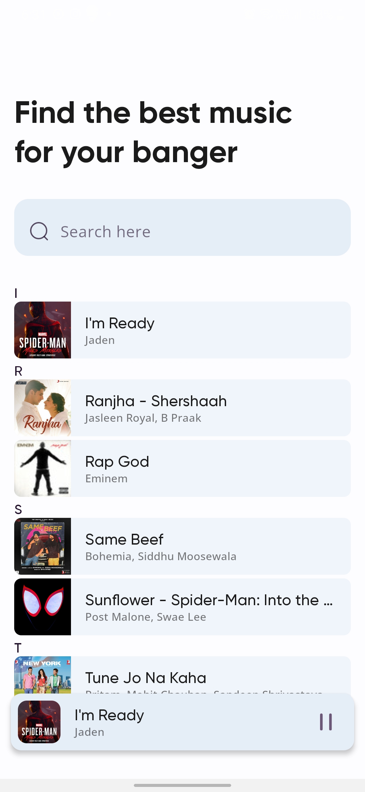
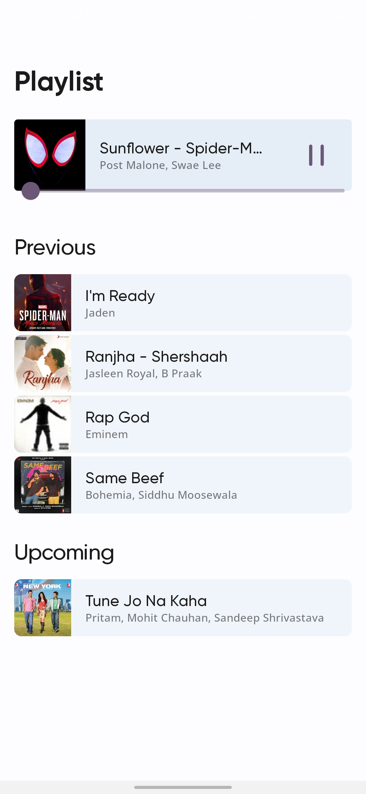
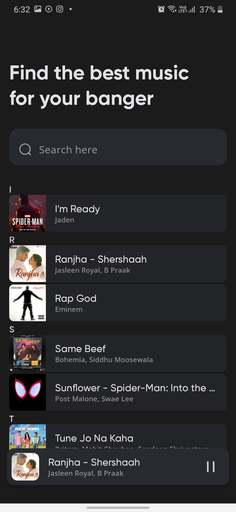

# **MusicX** 

**MusicX** is a music player app made using Jetpack Compose and follows Material 3 guidelines.

# Application Install

***You can Install and test latest Healthify app from below 👇***

[](https://github.com/Vaibhav2002/MusicX/releases/tag/v1.0.0)

## Setup
- Clone the repository on your machine.
- Create project in Firebase, enable firestore, set rules to public and download google-services.json and paste in the app folder.
- Add all your songs in Firestore.
- Add your AudD api key and base url in Secrets.kt
  ```kotlin
    const val API_KEY = ""  //add your AudD api key here
    const val BASE_URL = "" //add your AudD base url here
  ```
- I have create a sample music list which i uploaded on Firebase, you can use it , all you need to do is to download the mp3 and upload it on any cloud storage and add the url in the objects in MusicList.kt
```kotlin
    Music(
            id = UUID.randomUUID().toString(),
            title = "Rap God",
            artists = listOf("Eminem"),
            imageUrl = "https://i.scdn.co/image/ab67616d00004851643e6ecebab400d52574e4b2",
            musicUrl = "", // add the url here
            duration = 363000L
        ),
```

## About

It uses Firebase as its backend and also used AudD api to get lyrics of songs. 

- Fully functionable. 
- Clean and Simple Material 3 UI built using Jetpack Compose.
- It supports dark theme too 🌗.

### App Features

- **Home Screen** - Shows a list of all songs available.
- **Music Player Screen** - Music Player screen with music controls.
- **Playlist Screen** - Screen showing the current playlist/play queue.

### Insights into the app 🔎


## 📸 Screenshots

|||||
|:----------------------------------------:|:-----------------------------------------:|:-----------------------------------------: |:-----------------------------------------: |
|  |  |  |  |
|  |  |  |  |


### Technical details 

- MusicX uses Firebase to fetch all songs.
- MusicX uses AudD api to get lyrics of songs.
- MusicX is built fllowing Material 3 Guidelines.
- MusicX is built using [Jetpack Compose](https://developer.android.com/jetpack/compose?gclid=CjwKCAiArOqOBhBmEiwAsgeLmUlv4dbl6KV3yBs7SXOpYReSF8DaG5yWJipHnkO-OEWgyMHgjn1BixoC8bUQAvD_BwE&gclsrc=aw.ds).
- MusicX is made using Kotlin and following Modern Android Development practices.
- MusicX uses all Jetpack libraries and follows MVVM architecture. It also has a G.O.A.T rating in Android's  M.A.D scorecard.
- MusicX's code follows all the best practices and software development principles which make it a very good learning resource for beginners.


## Built With 🛠
- [Kotlin](https://kotlinlang.org/) - First class and official programming language for Android development.
- [Jetpack Compose](https://developer.android.com/jetpack/compose?gclid=CjwKCAiArOqOBhBmEiwAsgeLmUlv4dbl6KV3yBs7SXOpYReSF8DaG5yWJipHnkO-OEWgyMHgjn1BixoC8bUQAvD_BwE&gclsrc=aw.ds) - Jetpack Compose is Android’s modern toolkit for building native UI.
- [Material 3](https://m3.material.io) - Material Design 3, Google’s most expressive and adaptable design system
- [Coroutines](https://kotlinlang.org/docs/reference/coroutines-overview.html) - For asynchronous and more..
- [Flow](https://kotlin.github.io/kotlinx.coroutines/kotlinx-coroutines-core/kotlinx.coroutines.flow/-flow/) - A cold asynchronous data stream that sequentially emits values and completes normally or with an exception.
 - [StateFlow](https://developer.android.com/kotlin/flow/stateflow-and-sharedflow) - StateFlow is a state-holder observable flow that emits the current and new state updates to its collectors.
 - [SharedFlow](https://developer.android.com/kotlin/flow/stateflow-and-sharedflow) - A SharedFlow is a highly-configurable generalization of StateFlow.
- [Android Architecture Components](https://developer.android.com/topic/libraries/architecture) - Collection of libraries that help you design robust, testable, and maintainable apps.
  - [ViewModel](https://developer.android.com/topic/libraries/architecture/viewmodel) - Stores UI-related data that isn't destroyed on UI changes. 
  - [Room](https://developer.android.com/training/data-storage/room) - Room is an android library which is an ORM which wraps android's native SQLite database
- [Exoplayer](https://exoplayer.dev) - Exoplayer library is used to play media in Android.
- [Dependency Injection](https://developer.android.com/training/dependency-injection) - 
  - [Hilt-Dagger](https://dagger.dev/hilt/) - Standard library to incorporate Dagger dependency injection into an Android application.
  - [Hilt-ViewModel](https://developer.android.com/training/dependency-injection/hilt-jetpack) - DI for injecting `ViewModel`.
- Backend
  - [Firebase](https://firebase.google.com)
    - Firebase Firestore - A NoSQL database to store all data
    - Firebase Storage - A Cloud storage.
- [AudD Api](https://audd.io) - Api to fetch lyrics of songs
- [Retrofit](https://github.com/square/retrofit) - An Http Client for android.
- [Timber](https://github.com/JakeWharton/timber) - A simple logging library for android.
- [GSON Converter](https://github.com/square/retrofit/tree/master/retrofit-converters/gson) - A Converter which uses Moshi for serialization to and from JSON.
- [Coil](https://github.com/coil-kt/coil) - An image loading library for Android backed by Kotlin Coroutines.
- [Material Components for Android](https://github.com/material-components/material-components-android) - Modular and customizable Material Design UI components for Android.

# Package Structure
    
    dev.vaibhav.musicX    # Root Package
    .
    ├── data                    # For data handling.
    |   ├── local               # Room DB and its related classes
    |   ├── remote              # Firebase, Auth0 and their relative classes
    │   ├── model               # Model data classes and mapper classes, both remote and local entities
    │   └── repo                # Single source of data.
    |
    ├── di                      # Dependency Injection             
    │   └── module              # DI Modules
    |
    ├──exoplayer                # Exoplayer related files etc.
    |
    ├── ui                      # UI/View layer
    |   ├── components          # Common Composaled required.
    |   ├── screens             # All Screens in app.    
    │   ├── theme               # App theme related files.
    │   ├── usecases            # Use-cases for features.
    |   ├── utils               # Utility classes for UI.
    |
    └── utils                   # Utility Classes / Kotlin extensions


## Architecture
This app uses [***MVVM (Model View View-Model)***](https://developer.android.com/jetpack/docs/guide#recommended-app-arch) architecture.


  


---

## If you like my projects and want to support me to build more cool open source projects
  
<a href="https://www.buymeacoffee.com/VaibhavJaiswal"></a>

---

 ## Contact
If you need any help, you can connect with me.

Visit:- [Vaibhav Jaiswal](https://vaibhavjaiswal.vercel.app/#/)
  


